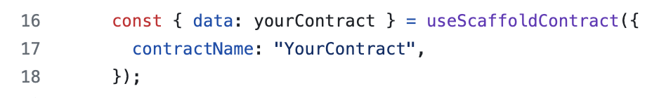
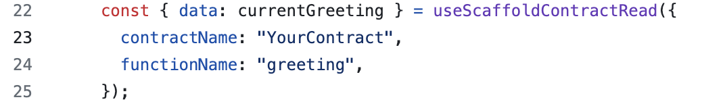
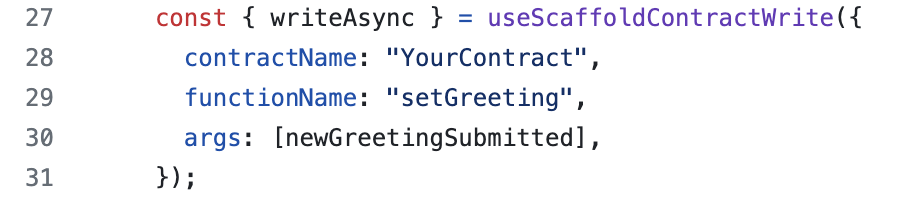

# 🏗 Conflux Scaffold

<h4 align="center">
  <a href="https://docs.scaffoldeth.io">Documentation</a> |
  <a href="https://scaffoldeth.io">Website</a>|
  <a href="https://doc.confluxnetwork.org/docs/overview">Conflux Developer Website</a>
</h4>

🧪 This repository modifies the repo Ethereum Scaffold ETH for Conflux ESpace. The main differences are as follows:

- It updates the viem package which includes Conflux Espace Testnet as a chain definition. Older versions of Scaffold-ETH-2 only has Conflux Espace. Conflux Espace Testnet Faucet for testfunds can be found in https://efaucet.confluxnetwork.org/.
- It adds deployment of hardhat to include Conflux Espace Testnet and Conflux Espace by adding the chains in hardhat.config.ts 
- It includes a simple example of interacting with the contract from read/write. It then shows how to change the wallet connection to Conflux Espace and Conflux Espace Testnet and deploying it on vercel

You can view the full tutorial of how to build an app quickly on Conflux in this [video](https://youtu.be/33S0IjGGsQg)


This allows developers on Conflux ESpace to leverage the open-source, up-to-date toolkit of Scaffold ETH-2 for building decentralized applications (dapps) on Conflux. It's designed to make it easier for developers to create and deploy smart contracts and build user interfaces that interact with those contracts.

⚙️ Built using NextJS, RainbowKit, Hardhat, Wagmi, Viem, and Typescript.

- ✅ **Contract Hot Reload**: Your frontend auto-adapts to your smart contract as you edit it.
- 🪝 **[Custom hooks](https://docs.scaffoldeth.io/hooks/)**: Collection of React hooks wrapper around [wagmi](https://wagmi.sh/) to simplify interactions with smart contracts with typescript autocompletion.
- 🧱 [**Components**](https://docs.scaffoldeth.io/components/): Collection of common web3 components to quickly build your frontend.
- 🔥 **Burner Wallet & Local Faucet**: Quickly test your application with a burner wallet and local faucet.
- 🔐 **Integration with Wallet Providers**: Connect to different wallet providers and interact with the Ethereum network.


## Requirements

Before you begin, you need to install the following tools:

- [Node (>= v18.17)](https://nodejs.org/en/download/)
- Yarn ([v1](https://classic.yarnpkg.com/en/docs/install/) or [v2+](https://yarnpkg.com/getting-started/install))
- [Git](https://git-scm.com/downloads)

## Quickstart

To get started with Conflux Scaffold, follow the steps below:

1. Clone this repo & install dependencies

```
git clone https://github.com/conflux-fans/conflux-scaffold
cd conflux-scaffold
yarn install
```

2. Run a local network in the first terminal:

```
yarn chain
```

This command starts a local Ethereum network using Hardhat. Since Conflux is EVM compatible, we can use hardhat to test the contracts out prior to deploying on the Conflux network. The network runs on your local machine and can be used for testing and development. 

We have adjusted the network configuration in `hardhat.config.ts` to include Conflux ESpace. If you are unable to interact with the testnets due to limits, you can switch network RPC endpoints for different regions in the 'hardhat.config.ts' file and re-deploy [network endpoints](https://doc.confluxnetwork.org/docs/espace/network-endpoints). For example, you can switch from [https://evmtestnet.confluxrpc.com](https://evmtestnet.confluxrpc.com) to [https://evmtestnet.confluxrpc.org](https://evmtestnet.confluxrpc.org). You can also add an API key at the end of the endpoint by purchasing a API key (with faucet tokens) at [confluxhub](https://test.confluxhub.io/payment/consumer/app/subscription/0x4805C5B2741088B8458ed781083eA8940186E477) for increased limits

3. On a second terminal, deploy the test contract:

```
yarn deploy
```

To deploy the contract on Conflux ESpace or Conflux ESpace Testnet, use 

```
yarn deploy --network confluxESpace 
```

or 

```
yarn deploy --network confluxESpaceTestnet
```

This command deploys a test smart contract to the local network. The contract is located in `packages/hardhat/contracts` and can be modified to suit your needs. The `yarn deploy` command uses the deploy script located in `packages/hardhat/deploy` to deploy the contract to the network. You can also customize the deploy script.

4. On a third terminal, start your NextJS app:

```
nvm use 18
yarn start
```

Visit your app on: `http://localhost:3000`. You can interact with your smart contract using the `Debug Contracts` page. You can tweak the app config in `packages/nextjs/scaffold.config.ts`.

Run smart contract test with `yarn hardhat:test`

- Edit your smart contract `YourContract.sol` in `packages/hardhat/contracts`
- Edit your frontend in `packages/nextjs/pages`
- Edit your deployment scripts in `packages/hardhat/deploy`

## Documentation

Visit our [docs](https://docs.scaffoldeth.io) to learn more components/hooks you can use with Conflux-Scaffold. There is also additional instructions on Conflux Developer Portal [tutorial](https://doc.confluxnetwork.org/docs/overview) which includes a section on using Conflux Scaffold

## Appendix

The Contract Debug section is powerful for quickly deploying your solidity contract and interacting with the functions


Front-end Interaction with the Contract is simplified through components and hooks

Note: Code has the latest versions of how contract instances are set up. For example, reading the contract is now useScaffoldReadContract and writing into the contract is now useScaffoldWriteContract. 

- Setting up a contract instance of the contract deployed



- Interacting with Contract to Read



- Interacting with Contract to Write


